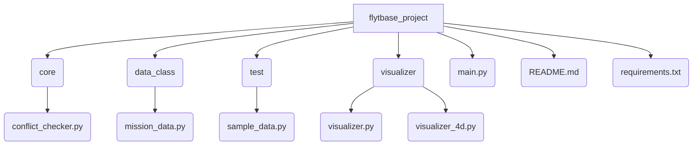
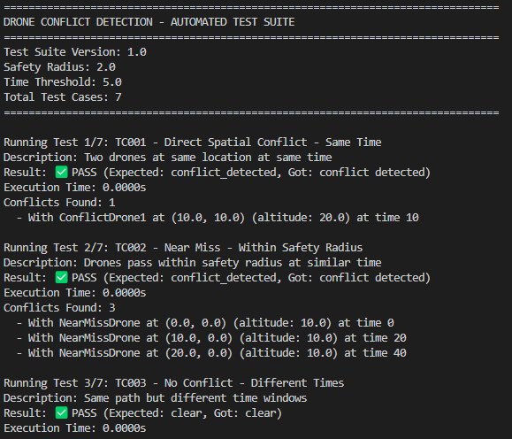

# UAV Strategic Deconfliction in Shared Airspace

A 4D UAV Strategic Deconfliction System built using Python and AI tools for the FlytBase Robotics Technical Assessment 2025.

---

## 📑 Table of Contents

* [About the Project](#about-the-project)
  * [Built With](#built-with)
  * [Code Quality & Architecture](#code-quality--architecture)
  * [Testing & Quality Assurance](#testing--quality-assurance)
* [Getting Started](#getting-started)
  * [Prerequisites](#prerequisites)
  * [Installation](#installation)
* [Usage](#usage)
* [Contributors](#contributors)

---

## 🚀 About the Project

This project implements a strategic deconfliction system that acts as the final authority for verifying whether a drone's waypoint mission is safe to execute in shared airspace.

### 🛠️ Built With

* Python
* Matplotlib
* Math, Random Libraries

---

## 🧱 Code Quality & Architecture

### 🧩 Modularity & Structure

```tree
C:.
│   main.py
│   README.md
│   requirements.txt
│  
├───core
│   │   conflict_checker.py
├───data_class
│   │   mission_data_class.py
├───test
│   │   generated_data.py
├───visualizer
│   │   visualizer.py
│   │   visualizer_4d.py
```



### 📏 Coding Standards

* **Style Guide:** [PEP8](https://peps.python.org/pep-0008/)
* **DocStrings:** [Best Practices](https://www.datacamp.com/tutorial/docstrings-python)
* **Type Hints:** [PEP484](https://peps.python.org/pep-0484/)

### 🧠 Architectural Decisions

* Used function-based modular design for isolated subsystems
* Components can be replaced or reused in scaled cloud deployments
* `check_conflicts()` function is decoupled from visuals/UI, enabling plug-and-play in APIs or embedded systems

### ✍️ Readability & Documentation

* In-line DocStrings and helper functions are added for all modules
* Maintains high clarity for future development or review

---

## ✅ Testing & Quality Assurance

### 📋 Test Case Design

1. **TC001**: Spatial Conflict – Same time, same position
2. **TC002**: Near Miss – Inside safety radius
3. **TC003**: No Conflict – Different times
4. **TC004**: No Conflict – Different altitudes
5. **TC005**: Multi-drone Conflict
6. **TC006**: Boundary Case – Exactly at safety threshold
7. **TC007**: Temporal Threshold – Time gap just at limit

### 🧪 Configuration Parameters

| Parameter          | Value       | Description                                |
| ------------------ | ----------- | ------------------------------------------ |
| Safety Radius      | 2.0 meters  | Minimum separation distance between drones |
| Time Threshold     | 5.0 seconds | Minimum time separation for same location  |
| Test Suite Version | 1.0         | Current version of test scenarios          |
| Total Test Cases   | 7           | Complete coverage scenarios                |

### 🤖 Test Automation

Example of Automated script running




### 🛡️ Robustness & Error Handling

* Validates types, values, and mission structure
* Ignores malformed missions gracefully without halting the system
* Logs context-aware debugging messages
* Helper function `validate_waypoint_coordinates()` ensures spatial integrity 
* [Example snippet](https://github.com/nishchayrobotics/drone-deconfliction-system/blob/main/core/conflict_checker.py)

### ✅ QA Thoughtfulness

* Layered validation and fallback ensures conflict-checking continues
* Handles edge cases, corrupted missions, and inconsistent telemetry inputs

#### 🔬 Test Coverage Summary

| Test Type          | Scenarios Covered   | Purpose                      |
| ------------------ | ------------------- | ---------------------------- |
| Conflict Detection | TC001, TC002, TC005 | Validate collision detection |
| Safety Validation  | TC003, TC004, TC007 | Ensure separation compliance |
| Boundary Testing   | TC006, TC007        | Test precision at thresholds |

---

## 🧰 Getting Started

### 🔧 Prerequisites

```bash
pip install -r requirements.txt
```

### ⚙️ Installation

```bash
git clone https://github.com/nishchayrobotics/drone-deconfliction-system.git
cd drone-deconfliction-system
python main.py
```

---

## 🛠️ Usage

Use `main.py` to:

* Randomly selected between scenarios: `conflict`, `no_conflict`, `edge_case`
* Generate visualization (2D or animated 4D)

```bash
python main.py
python -m test.automated_test_runner    #To run the automated script
```

---

## 🤝 Contributors

* **Nishchay Choudha** — BTech ECE, VIT Vellore

---