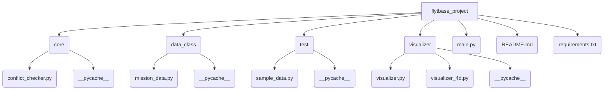

[![Issues][issues-shield]][issues-url]

<!-- PROJECT LOGO -->

  <h3 align="center">UAV Strategic Deconfliction in Shared
Airspace</h3>

  <p align="center">
    A 4D UAV Strategic Deconfliction System built using Python and AI tools For FlytBase Technical Assessment.
    <br />
    <a href="https://github.com/csivitu/Template"><strong>Explore the docs »</strong></a>
    <br />
    <br />
    <a href="https://github.com/csivitu/Template">View Demo</a>
    ·
    <a href="https://github.com/csivitu/Template/issues">Report Bug</a>
    ·
    <a href="https://github.com/csivitu/Template/issues">Request Feature</a>
  </p>
</p>


<!-- TABLE OF CONTENTS -->
## Table of Contents

* [About the Project](#about-the-project)
  * [Built With](#built-with)
  * [Code quality and Archieticture](#Code-quality-and-Archieticture)
  * [Testability and Quality Assurance](#Testability-and-Quality-Assurance)
  * [Effective Use of AI and Resourcefulness](#Effective-Use-of-AI-and-Resourcefulness)
  * [Documentation, Reflection, and Communication](#Documentation,-Reflection,-and-Communication)
  * []
* [Getting Started](#getting-started)
  * [Prerequisites](#prerequisites)
  * [Installation](#installation)
* [Usage](#usage)
* [Roadmap](#roadmap)
* [Contributing](#contributing)
* [License](#license)
* [Contributors](#contributors-)


<!-- ABOUT THE PROJECT -->
## About The Project

[![Product Name Screen Shot][product-screenshot]](https://example.com)

Implemented a strategic deconfliction system that serves as the final authority for
verifying whether a drone's planned waypoint mission is safe to execute in shared airspace.


### Built With

* [Python]()
* [Matplotlib]()
* [Math]()

### Code quality and Archieticture

#### Modularity and Structure
```tree
C:.
│   main.py
│   README.md
│   requirements.txt
│   
├───core
│   │   conflict_checker.py   
│
├───data_class
│   │   mission_data_class.py
│
├───test
│   │   generated_data.py
│
├───visualizer
│   │   visualizer.py
│   │   visualizer_4d.py
```


<!-- GETTING STARTED -->
## Getting Started

To get a local copy up and running follow these simple steps.

### Prerequisites

This is an example of how to list things you need to use the software and how to install them.
* npm
```sh
npm install npm@latest -g
```

### Installation
 
1. Clone the repo
```sh
git clone https://github.com/csivitu/Template.git
```
2. Install NPM packages
```sh
npm install
```


<!-- USAGE EXAMPLES -->
## Usage

Use this space to show useful examples of how a project can be used. Additional screenshots, code examples and demos work well in this space. You may also link to more resources.

_For more examples, please refer to the [Documentation](https://example.com)_


[csivitu-shield]: https://img.shields.io/badge/csivitu-csivitu-blue
[csivitu-url]: https://csivit.com
[issues-shield]: https://img.shields.io/github/issues/csivitu/Template.svg?style=flat-square
[issues-url]: https://github.com/csivitu/Template/issues